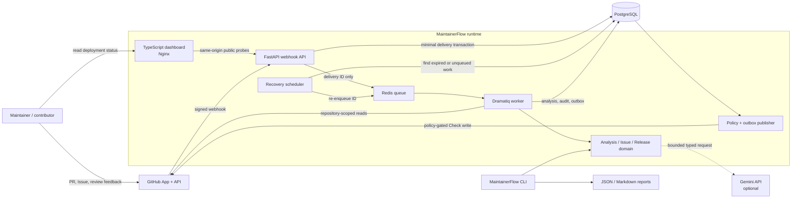
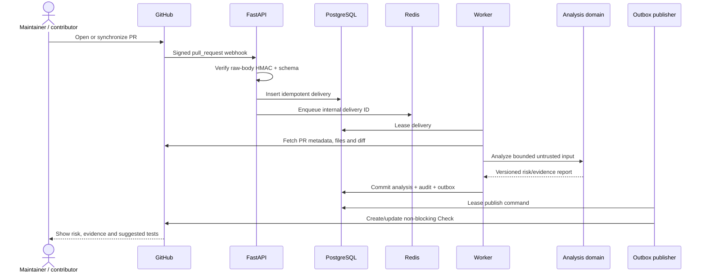

# Architecture

MaintainerFlow is a self-hosted GitHub App. It converts signed GitHub events into deterministic,
auditable suggestions. GitHub writes are isolated behind policy and an outbox; issue triage and
release preview never write to GitHub.

## System boundary

```text
GitHub App webhook
        |
        v
FastAPI ingestion -> PostgreSQL delivery -> Redis/Dramatiq worker
                                              |
                       +----------------------+----------------------+
                       |                      |                      |
                  PR analysis           Issue triage       Repository index
                       |                      |                      |
                       +----------> PostgreSQL audit/cache <--------+
                       |
                 policy + outbox -> GitHub Checks API

Offline CLI -> PR fixture analysis / release-note preview / reproducible benchmark

Maintainer browser -> Nginx frontend -> /api/health, /api/ready, /api/openapi.json -> FastAPI
```

### Component diagram



Solid arrows are current runtime paths. The dotted Gemini path exists only when AI is enabled;
static analysis remains the required fallback. Issue triage and release preview stop at
PostgreSQL/report output and do not enter the GitHub-write publisher.

### Pull-request data flow



Runtime services are `frontend`, `api`, `worker`, `recovery`, PostgreSQL, and Redis. The frontend
is a separate read-only failure domain: it proxies public probes but does not handle webhook
delivery or receive application secrets. PostgreSQL is the system
of record. Redis carries task notifications; losing a notification does not lose a delivery because
the recovery process re-enqueues expired or unqueued work.

## Module boundaries

| Layer | Packages | Responsibility |
| --- | --- | --- |
| Presentation | `frontend` | Render public deployment status and API-doc links; no domain rules or secrets. |
| Transport | `api`, `github`, `cli` | Validate input, call GitHub, render CLI output; no analysis rules. |
| Orchestration | `services`, `worker` | Transactions, leases, idempotency and workflow order. |
| Domain | `analysis`, `issue`, `release`, `core` | Pure parsing, scoring, classification, policy and rendering. |
| Provider | `ai` | Optional Gemini adapter with a typed response contract and safe fallback. |
| Persistence | `persistence` | SQLAlchemy models/repositories, audit records, caches and outbox. |

Dependencies point downward through this table. Domain modules must not import FastAPI, Dramatiq,
SQLAlchemy, GitHub clients, or environment settings. Provider-specific output is normalized before
it enters a report. New language analyzers implement `LanguageAnalyzer`; new benchmark strategies
implement the runner contract instead of branching in metric code.

## Event sequences

### Pull request: CP1 -> CP2 -> CP3 -> CP4 context

1. `POST /webhooks/github` reads the raw body and verifies `X-Hub-Signature-256` with HMAC-SHA256.
2. Only `pull_request.opened` and `pull_request.synchronize` become minimal delivery envelopes.
   Unsupported actions return `ignored`; duplicate `X-GitHub-Delivery` values are idempotent.
3. The API commits the delivery before enqueueing it. If Redis is unavailable, recovery later
   retries from PostgreSQL.
4. A worker leases the delivery, creates a short-lived installation token, and fetches PR metadata,
   files and compare diff. Optional repository intelligence is cached by repository, commit SHA and
   analyzer version.
5. Static analysis always runs. Optional Gemini analysis receives a bounded excerpt and must return
   the typed schema; timeout, outage or invalid output produces a static report with a limitation.
6. The snapshot identity includes repository/PR SHAs, content hashes, rules, prompt, model, config,
   and repository-context identity. Re-delivery therefore reuses only an equivalent result.
7. Publishing policy defaults to `shadow`. In `suggestion` mode it may enqueue a neutral/success
   Check Run. The transaction commits analysis, audit and outbox together.
8. The outbox dispatcher obtains a fresh token and performs idempotent Check Run create/update.
   Retryable failures back off; permanent/exhausted failures become `dead_letter` without changing
   the analysis result.

### Issue: CP1 -> CP4, isolated from CP3 writes

1. A signed `issues.opened` event is stored and leased through the same CP1 delivery path.
2. When issue triage is enabled, the worker reads the issue, existing issues and repository labels.
3. Deterministic classifiers produce category, confidence/evidence spans, priority, label
   suggestions and lexical duplicate candidates.
4. The source hash makes the persisted issue analysis idempotent. By default the body is not stored;
   evidence snippets and derived suggestions may still contain short source fragments.
5. `issue.triage.suggested` is audited. This path never creates an outbox event and never labels,
   closes, assigns or comments on the issue.

### Release assistant and evaluation: CP5

Release input is an explicit, versioned fixture or data collected by the release service. The
domain classifier groups merged PRs deterministically, the breaking scanner only marks candidates,
and the renderer preserves compare/PR provenance. CLI `release` is preview/export only: a human must
review the file. Benchmark runners use locked manifests and emit strategy metrics plus environment
metadata; private source, API keys and raw provider payloads do not belong in reports.

The tag workflow is a separate privileged boundary. A semantic tag must equal the package version,
and tests, lint, typing, migrations, smoke tests and benchmarks must pass before the job receives
`contents: write` and creates a release. The release contains wheel/sdist, notes, checksums and build
metadata.

## Data model and guarantees

| Data | Identity / guarantee |
| --- | --- |
| Delivery | Unique GitHub delivery ID; lease and terminal state. |
| PR snapshot/result | Content-addressed snapshot; one analysis per snapshot. |
| Evidence | Linked to an analysis and includes source/confidence. |
| Outbox | Unique idempotency key; pending/processing/sent/dead-letter lifecycle. |
| Audit | Append-only application events for analysis, publishing, feedback, issue/release actions. |
| Repository index | Repository + commit SHA + analyzer version; expiry timestamp. |
| Issue analysis | Repository + GitHub issue ID + source hash; expiry timestamp. |
| Release draft | Compare range/input identity; deterministic candidate notes, never an implicit publish. |

These are application-level delivery guarantees, not distributed exactly-once execution. External
GitHub calls can be retried, so write clients search by MaintainerFlow external/idempotency identity
before creating a new Check Run.

## Safety and known limits

- Reports are advice, not merge gates. `shadow` is the default and `suggestion` never concludes
  failure.
- PR text, diffs, issue text and repository content are untrusted. Rendered Check text is length
  bounded, escaped and secret-like tokens are redacted. Static parsers do not execute repository
  code.
- The Python AST analyzer is the first language implementation. Other languages appear only in the
  file tree until an analyzer is added.
- Lexical duplicate search is a baseline, not semantic proof of duplication.
- PostgreSQL backup, TLS termination, secret management and retention execution remain operator
  responsibilities in self-hosted deployments.

See [Security](security.md), [Privacy](privacy.md), [GitHub App setup](github-app-setup.md), and
[Self-hosting](self-hosting.md).
